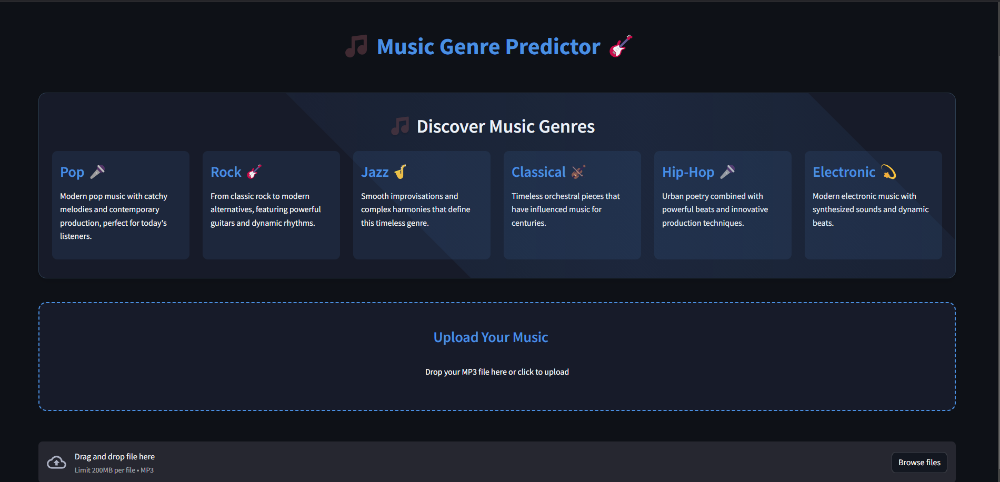
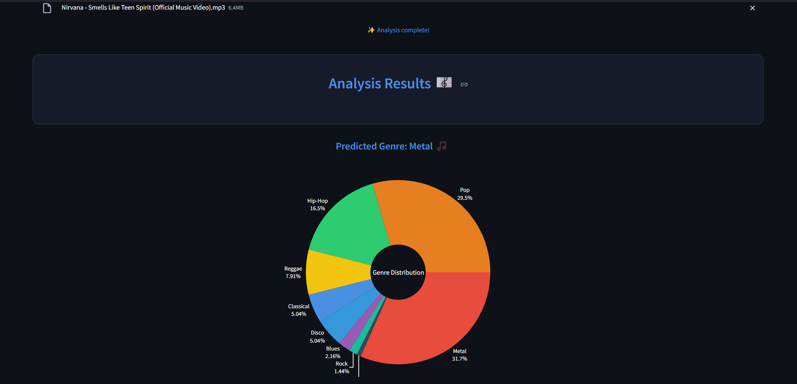

# Music Genre Classifier


A complete, AI-powered music genre classification system that classifies audio files into one of ten genres using a deep learning model trained on Mel spectrogram representations. Upload any MP3 file and receive an accurate genre prediction along with interactive visualizations showing the confidence distribution across all supported genres.

---

## Table of Contents

- [Overview](#overview)
- [Demo](#demo)
- [Architecture](#architecture)
  - [Frontend](#frontend)
  - [Backend and Model Serving](#backend-and-model-serving)
- [Model Architecture](#model-architecture)
- [Data Handling and Audio Preprocessing](#data-handling-and-audio-preprocessing)
  - [Audio Chunking](#audio-chunking)
  - [Mel Spectrogram Generation](#mel-spectrogram-generation)
  - [Majority Voting for Final Prediction](#majority-voting-for-final-prediction)
- [Supported Genres](#supported-genres)
- [Features](#features)
- [Installation and Setup](#installation-and-setup)
- [Usage](#usage)
- [Contributing](#contributing)
- [License](#license)

---

## Overview

**Music Genre Classifier** is a full-stack machine learning web application that allows users to upload an MP3 audio file and receive real-time genre classification results. The system uses a TensorFlow-based Convolutional Neural Network (CNN) trained on Mel spectrogram images derived from audio data. It segments audio into overlapping chunks, generates a Mel spectrogram for each chunk, classifies each one independently, and uses a majority voting strategy to determine the final genre prediction. The results are displayed as an interactive Plotly donut chart alongside the predicted genre label.

The application is built with Streamlit for the frontend and is deployed on Hugging Face Spaces for public access.

---

## Demo

Try out the live application here: [Music Genre Classifier Live Demo](https://huggingface.co/spaces/Agamrampal/Music)

Below are screenshots of the deployed application interface:





---

## Architecture

The project follows a single-application architecture where the UI, model serving, and preprocessing logic all coexist within a single Streamlit Python script (`app.py`).

### Frontend

- **Framework**: Streamlit, a Python-native framework for building interactive data applications.
- **Styling**: Custom CSS injected via `st.markdown` for a dark-themed, animated UI with card layouts, hover effects, glowing animations, a loading wave indicator, and responsive grid layouts for genre descriptions.
- **Visualization**: Plotly is used to render an interactive donut chart showing the genre distribution predicted across all audio chunks.

### Backend and Model Serving

- **Model Loading**: The trained TensorFlow model (`Trained_model.h5`) is downloaded from Google Drive on first run using `gdown` and cached via `st.cache_resource` to avoid redundant downloads on subsequent requests.
- **Inference**: TensorFlow handles model loading and prediction. Audio preprocessing leverages both `librosa` (for loading raw audio) and `torchaudio` (for Mel spectrogram transform generation).
- **Deployment**: The entire app is deployed as a Hugging Face Space, serving both the UI and the model inference from a single container.

---

## Model Architecture

The core of the classifier is a TensorFlow/Keras Convolutional Neural Network (CNN). Rather than working directly on raw audio waveforms, the model operates on 2D Mel spectrogram images, treating genre classification as an image classification task. Key characteristics of this approach include:

1. **Input Representation**: Each audio chunk is converted into a single-channel Mel spectrogram image, resized to a fixed spatial resolution of 210 x 210 pixels. This ensures a uniform input shape regardless of the original audio's sample rate or duration.
2. **Convolutional Layers**: The CNN applies a series of convolutional and pooling layers to extract hierarchical spatial features from the spectrogram, capturing patterns in frequency and time that are characteristic of different genres.
3. **Classification Output**: The final layer produces a probability distribution over 10 genre classes using a softmax activation. The class with the highest probability for each chunk becomes that chunk's prediction.
4. **Model Storage**: The trained model weights are stored as an `.h5` file on Google Drive and are automatically fetched and cached at application startup.

---

## Data Handling and Audio Preprocessing

The data handling pipeline is a critical component that bridges the gap between a raw MP3 upload and the tensor-formatted input the CNN expects. The pipeline is implemented in the `load_and_preprocess_file` function.

### Audio Chunking

Rather than feeding the entire audio track as a single input, the system segments the audio into smaller overlapping chunks to capture genre-relevant patterns across different parts of the track:

- **Chunk Duration**: 4 seconds.
- **Overlap Duration**: 2 seconds (50% overlap between consecutive chunks).
- The number of chunks is calculated dynamically based on the total length of the audio file.
- If the final chunk is shorter than 4 seconds, it is zero-padded to maintain a consistent length.

### Mel Spectrogram Generation

For each audio chunk, the following steps are performed:

1. **Audio Loading**: The raw audio file is loaded using `librosa.load()`, which decodes the MP3 and returns a NumPy array of audio samples along with the sample rate.
2. **Tensor Conversion**: The chunk is converted into a PyTorch tensor.
3. **Mel Spectrogram Transform**: The `torchaudio.transforms.MelSpectrogram()` transform is applied to convert the time-domain audio signal into a frequency-domain Mel spectrogram representation.
4. **Resizing**: The resulting spectrogram is resized to a fixed 210 x 210 pixel resolution using `tensorflow.image.resize` to match the model's expected input dimensions.
5. **Reshaping**: The spectrogram is reshaped into the format `(1, 210, 210, 1)` (batch size, height, width, channels) required by the TensorFlow model.

### Majority Voting for Final Prediction

Each chunk is classified independently by the CNN. The final genre prediction is determined by a **majority voting** strategy:

- The `Counter` class from Python's `collections` module tallies the predictions across all chunks.
- The genre that receives the most votes (the most common prediction) is selected as the overall genre for the track.
- The full vote distribution is visualized as a Plotly donut chart, providing transparency into how confident the model was across the entire track.

---

## Supported Genres

The model classifies audio into the following 10 genres:

- Blues
- Classical
- Country
- Disco
- Hip-Hop
- Jazz
- Metal
- Pop
- Reggae
- Rock

---

## Features

- **10-Class Genre Classification**: Covers a wide spectrum of popular music genres.
- **Overlapping Chunk Analysis**: Processes audio in 4-second overlapping windows for robust predictions.
- **Majority Voting**: Aggregates per-chunk predictions for a reliable final result.
- **Interactive Visualizations**: Plotly-based donut charts display the full genre probability distribution.
- **Real-Time Feedback**: Progress bar and animated loading indicators provide instant user feedback during processing.
- **Automated Model Download**: The trained model is fetched from Google Drive and cached locally on first launch.

---

## Installation and Setup

```bash
# Clone the repository
git clone https://github.com/agam25rpro/MusicGenreClassifier.git

# Navigate to the project directory
cd MusicGenreClassifier

# Create and activate a virtual environment (recommended)
python -m venv venv
source venv/bin/activate  # On Windows: venv\Scripts\activate

# Install dependencies
pip install -r requirements.txt

# Run the application
streamlit run app.py
```

The application will open in your browser at `http://localhost:8501`.

---

## Usage

1. Visit the application URL (either the local Streamlit server or the Hugging Face Space).
2. Scroll down to the upload section.
3. Click the upload button and select an MP3 file from your device.
4. Wait for the processing pipeline to complete (audio chunking, spectrogram generation, and model inference).
5. View the predicted genre and explore the interactive donut chart showing the classification distribution across all chunks.

---

## Contributing

Contributions are welcome. To contribute:

1. Fork the repository.
2. Create a new branch:
   ```bash
   git checkout -b feature/your-feature-name
   ```
3. Make your changes and commit:
   ```bash
   git commit -m "Add some feature"
   ```
4. Push to the branch:
   ```bash
   git push origin feature/your-feature-name
   ```
5. Submit a Pull Request on GitHub.

---

## License

This project is licensed under the Apache License. See the [LICENSE](LICENSE.txt) file for details.
