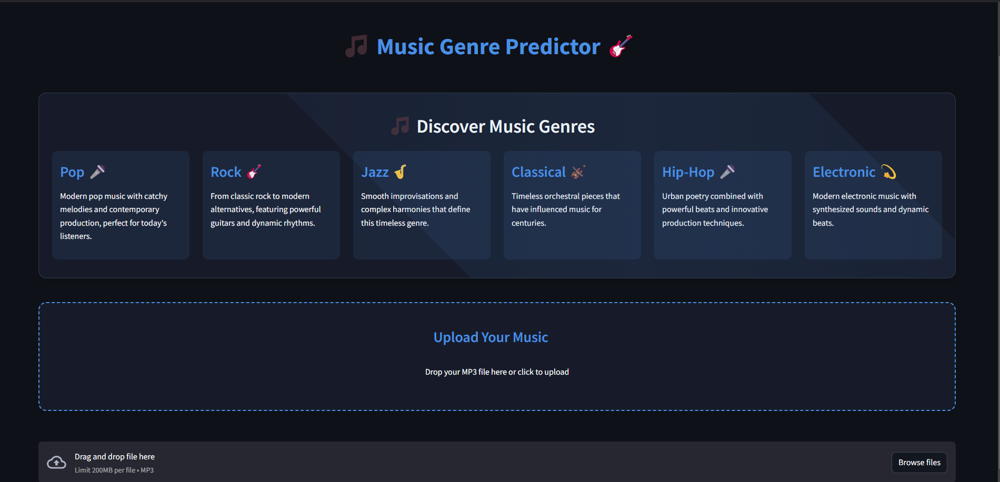
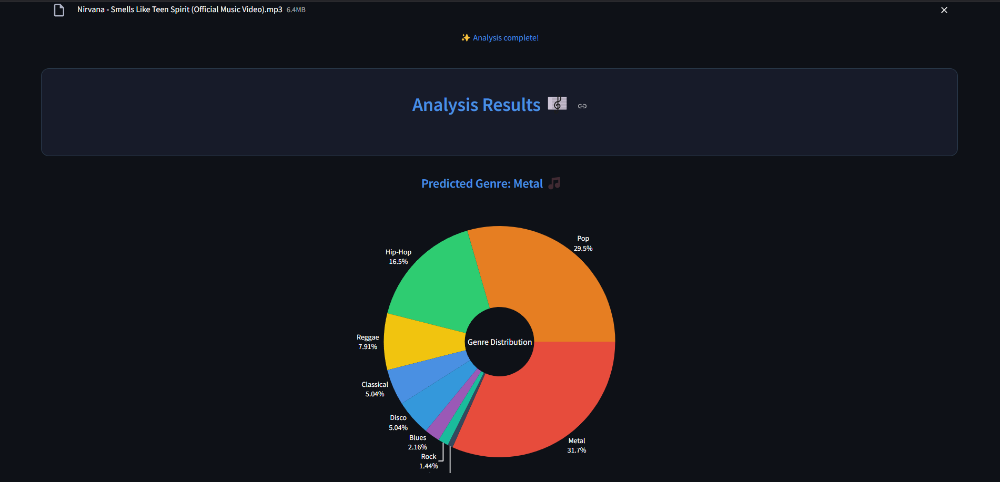

# 🎵 Music Genre Classifier

An elegant and interactive AI-powered music genre classification system that helps you understand your music better! 🎧

---

## ✨ Features

- 🤖 **Advanced AI Model** for accurate genre prediction
- 📊 **Beautiful Interactive Visualizations**
- ⚡ **Real-Time Processing and Classification**
- 🎨 **Clean, Modern User Interface**
- 📱 **Mobile-Friendly Design**

---

## 🚀 Live Demo

Try it out now on [This link](https://huggingface.co/spaces/Agamrampal/Music): **Music Genre Classifier**

---

## 🛠️ Technology Stack

- **Frontend**: Streamlit
- **Backend**: Python
- **ML Framework**: TensorFlow / PyTorch
- **Audio Processing**: Librosa / Torchaudio
- **Visualization**: Plotly

---

## 💫 How It Works

1. **Upload**: Simply upload your music file through the intuitive interface.
2. **Process**: Our AI model analyzes the audio patterns and features.
3. **Classify**: Advanced algorithms determine the music genre.
4. **Visualize**: See beautiful interactive visualizations of the results.





---

## 🎯 Supported Genres

- 🎸 **Rock**
- 🎹 **Classical**
- 🎷 **Jazz**
- 🎤 **Hip Hop**
- 💃 **Pop**
- 🪘 **Electronic**
- And more!

---

## 🔧 Installation

```bash
# Clone the repository
git clone https://github.com/yourusername/music-genre-classifier.git

# Navigate to the project directory
cd music-genre-classifier

# Install dependencies
pip install -r requirements.txt

# Run the application
streamlit run app.py
```

---

## 📖 Usage

1. Visit the application URL.
2. Click the **Upload** button.
3. Select your music file.
4. Wait for the magic to happen ✨.
5. Explore the interactive visualizations and results.

---

## 🤝 Contributing

Contributions are welcome! Please feel free to fork the repository and submit a Pull Request.

1. Fork the repository.
2. Create a new branch: `git checkout -b feature/your-feature-name`.
3. Make your changes and commit: `git commit -m 'Add some feature'`.
4. Push to the branch: `git push origin feature/your-feature-name`.
5. Submit a Pull Request.

---

## 📝 License

This project is licensed under the Apache License - see the [LICENSE](LICENSE) file for details.

---

Made with ❤️ by [Your Name/Team Name]